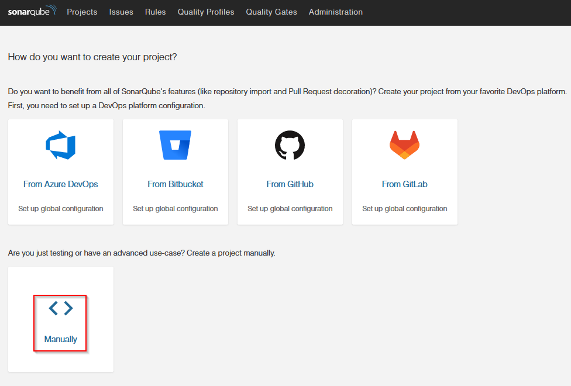
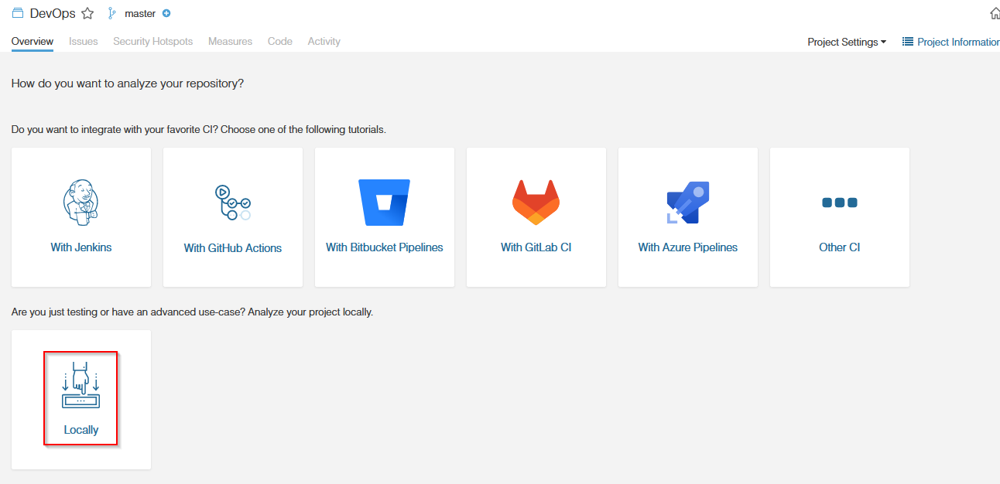

# Aufgabe 1: kollaborative Entwicklung
Im Folgenden werden die Schritte zu [Aufgabe 1](https://moodle.ffhs.ch/mod/assign/view.php?id=4133060) dokumentiert:

## Quellcodeverwaltung mit Git
Der Quellcode wird mittels Git lokal und im remote Repository [https://git.ffhs.ch/matthias.heimberg/devops](https://git.ffhs.ch/matthias.heimberg/devops) versioniert. Dazu wurde ein leeres Repository in `git.ffhs.ch` erstellt in welches der lokale Code mittels 
```bash
git init --initial-branch=main
git remote add origin https://git.ffhs.ch/matthias.heimberg/devops.git
git add .
git commit -m "init"
git push -u origin main
 ```
initial gepusht wurde. Der aktuelle Stand wird jeweils mittels
```bash
git add .
git commit -m "commit message"
git push -u origin main
```
in das remote Repository geladen. Gemäss Aufgabenstellung wurden die zwei zusätzlichen Branches
- `develop`
- `release`

mittels
```bash
git branch <branch name>
git push origin <branch name>:<branch name>
```
lokal erstellt und in das remote Repository gepusht.

## Quellcodeüberprüfung mittels SonarQube
Der Quellcode soll gemäss Aufgabenstellung mittels [SonarQube](https://www.sonarqube.org/) überprüft werden. Dazu wurde ein lokaler SonarQube Server eingerichtet, mit welchem der Quellcode lokal geprüft wird.

### SonarQube Server
Sonarqube wird mittels 
```bash
docker run -d --name sonarqube -p 9000:9000 -p 9092:9092 sonarqube
```
als Docker Container gestartet. Das Webinterface ist danach unter `localhost:9000/` erreichbar.

### Analyse des Quellcodes
Zunächst wird das Projekt manuell eingebunden:



Es wird der Projektname `DevOps` und der Project Key `DevOps` gewählt. Anschliessend wird die lokale Analyse ausgewählt



Anschliessend wird der Projekt-Token generiert. Die Analyse kann nun im lokalen Terminal mittels
```bash
./gradlew sonarqube   -D"sonar.projectKey=DevOps" \
-D"sonar.host.url=http://localhost:9000" 
-D"sonar.login=<project token>"
```
gestartet werden. Die Analysedaten werden anschliessend über den Endpunkt `ocalhost:9000/api/issues/search` heruntergeladen. 

## Dokumentation
Die Dokumentation wird jeweils aus der vorliegenden Markdown Datei mittels
```bash
pandoc --pdf-engine=xelatex <path/source file> -o <output file>
```
in ein PDF umgewandelt.

## Probleme
Im ersten Teil der Semesterarbeit sind keine grösseren Schwierigkeiten aufgetreten. Einzig der Befehl zur SonarQube Analyse musste auf das vorliegende Betriebssystem (Windows 10) angepasst werden. Dies konnte bereits in der PVA 1 durch einen Hinweis des Dozenten (Verwenden von Quotes) gelöst werden.
