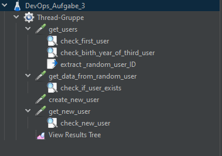

# Aufgabe 3: JMeter und ZAP

Im Rahmen der Aufgabe 3 soll die Webapplikation mit JMeter und ZAP getestet werden (vgl. [Aufgabe 3](https://moodle.ffhs.ch/mod/assign/view.php?id=4133081)).

## JMeter
Zunächst wird, wie in der [Jenkins-Dokumentation](https://www.jenkins.io/doc/book/using/using-jmeter-with-jenkins/) beschrieben, das [Performance Plugin](https://plugins.jenkins.io/performance) installiert. 
### Docker Image
In dieser Arbeit wird, wie bereits in Aufgabe 2 beschrieben, versucht, möglichst alle benötigten Services als Docker Container zu starten. Dazu wird ein Docker Image für JMeter verwendet. Das Docker Image wird von [https://hub.docker.com/r/justb4/jmeter](https://hub.docker.com/r/justb4/jmeter) bezogen, es ist kein offizielles Docker Image von JMeter. Für ein produktives Setup mit Docker sollte ein eigenes Image erstellt und gewartet werden, dies wird aus Zeitgründen in dieser Arbeit nicht gemacht. 

### Zugriff auf Docker Socket
Um Docker Container aus Jenkins (welches hier selbst in einem Container läuft) starten zu können, gibt es unterschiedliche Möglichkeiten:
- Docker in Docker (DinD)
- Zugriff auf Docker Socket (Docker Socket Bind Mount)
In [https://jpetazzo.github.io/2015/09/03/do-not-use-docker-in-docker-for-ci/](https://jpetazzo.github.io/2015/09/03/do-not-use-docker-in-docker-for-ci/) wird aus verschiedenen Gründen (Sicherheit, Kompatibilität) empfohlen, auf Docker in Docker zu verzichten und stattdessen auf den Docker Socket zu binden. Dieser Zugriff ist nicht ganz trivial, da der Jenkins Container nicht als `root` läuft und der Docker Socket nur für `root` zugänglich ist. Dazu wurden folgende Ergänzungen an der `docker-compose.yml` Datei vorgenommen:
1. Ein spezifisches Docker Network wurde erstellt, damit die Container untereinander kommunizieren können (vgl. [https://docs.docker.com/network/bridge/](https://docs.docker.com/network/bridge/))
2. Der Docker Socket wird an den Jenkins Container gebunden (vgl. [https://docs.docker.com/engine/security/rootless/](https://docs.docker.com/engine/security/rootless/))

Damit sieht die `docker-compose.yml` Datei wie folgt aus:
```yaml
version: "3.8"
services:
  jenkins:
      image: jenkins/jenkins:lts
      container_name: jenkins
      user: root
      ports:
          - "8080:8080"
          - "50000:50000"
      volumes:
          - ./jenkins-data:/var/jenkins_home
          - //var/run/docker.sock://var/run/docker.sock
      restart: always
      networks:
          - jenkins

  sonarqube:
      image: sonarqube:latest
      container_name: sonarqube
      ports:
          - "9000:9000"
          - "9092:9092"
      volumes:
          - ./sonarqube-data:/opt/sonarqube/data
          - ./sonarqube-extensions:/opt/sonarqube/extensions
          - ./sonarqube-logs:/opt/sonarqube/logs
          - ./sonarqube-temp:/opt/sonarqube/temp
      restart: always
      networks:
          - jenkins

networks:
    jenkins:
        driver: bridge
```
Wird `docker compose` auf einem Windows Host ausgeführt, muss zunächst die Variable `COMPOSE_CONVERT_WINDOWS_PATHS=1` gesetzt werden, damit der Pfad korrekt gemountet wird. Hierzu wird eine `.env` Datei erstellt, welche folgenden Inhalt hat:
```env
COMPOSE_CONVERT_WINDOWS_PATHS=1
```
Diese Datei muss im selben Verzeichnis wie die `docker-compose.yml` Datei liegen. Zudem muss Docker im Jenkins Container installiert werden. Dies erfolgt manuell in der CLI mittels `curl https://get.docker.com/ > dockerinstall && chmod 777 dockerinstall && ./dockerinstall`.

Ist Docker im Jenkins Container installiert, kann nun aus dem Jenkins Container auf den Docker Socket zugegriffen werden. Damit lässt sich JMeter in einem Docker Container parallel zum Jenkins Container starten und ausführen. Die Test-Scripte müssen im Verzeichnis `/jmeter-data/scripts` liegen, damit sie vom Jenkins Container aus gefunden werden können.

### Einbinden von JMeter in das Jenkinsfile
Die JMeter Tests werden als weiterer Step im Jenkinsfile definiert. Dazu wird der folgende Code verwendet:
```groovy
// test with jmeter inside docker container (jenkins container binds to 
// docker socket on host)
        stage('test with jmeter') {
            steps {
                gitlabCommitStatus(name: 'test with jmeter') {
                    sh '''
                        export TIMESTAMP=$(date +%Y%m%d_%H%M%S)
                        export JMETER_PATH=/mnt/jmeter
                        docker run --rm -v jmeter-data:"${JMETER_PATH}" /
                        justb4/jmeter -n -t /mnt/jmeter/scripts /
                        -l "${JMETER_PATH}"/tmp/result_"${TIMESTAMP}".jtl /
                        -j "${JMETER_PATH}/tmp/jmeter_${TIMESTAMP}".log 
                    '''
                }
            }
        }
```
Der Befehl `docker run` startet einen Docker Container mit dem Image `justb4/jmeter` (auf dem Host, Zugriff über den via docker compose freigegebenen Docker Socket). Dieses Image enthält JMeter (Quelle: [github.com/justb4/docker-jmeter](https://github.com/justb4/docker-jmeter)). Der Befehl `--rm` sorgt dafür, dass der Container nach dem Test gelöscht wird. Das lokale Volume `jmeter-data` wird an den Pfad `/mnt/jmeter` gemountet. Der Pfad `/mnt/jmeter` ist der Pfad, an dem JMeter im Container erwartet, dass die Test-Scripts liegen. Der Befehl `-n` sorgt dafür, dass JMeter im Non-GUI Modus läuft. Der Befehl `-t` gibt den Pfad an, an dem die Test-Scripts liegen. Der Befehl `-l` gibt den Pfad an, an dem das Ergebnis des Tests gespeichert werden soll. Der Befehl `-j` gibt den Pfad an, an dem das Log des Tests gespeichert werden soll.

### Fehlschlag beim Einbinden des Volumes
Probleme mit dem Einbinden des Volumes `jemeter-data` vom Host in den JMeter Container, welcher über den Docker Socket des Hosts aus dem Jenkins Container heraus gestartet wird, konnten auch nach mehreren Stunden nicht gelöst werden. Deshalb wurde nach einiger Recherche der folgende Ansatz verfolgt:
1. Jmeter wird wie zuvor in einem Docker Container gestartet
2. Der Start des JMeter Containers wird durch einen `docker agent` im Jenkinsfile ausgeführt
3. Dazu müssen die Plugins `Docker` und `Docker Pipeline` in Jenkins installiert werden

Damit wird der entsprechende Step im Jenkinsfile wie folgt abgeändert:
```groovy
stage('test with jmeter') {
            agent { 
                docker {
                    image 'justb4/jmeter:5.1.1'
                    args '-v /var/jenkins_home/jmeter-data:/home/user/jmeter'
                }
            }
            steps {
                gitlabCommitStatus(name: 'test with jmeter') {
                    sh '''
                        export TIMESTAMP=$(date +%Y%m%d_%H%M%S)
                        jmeter -n -t /home/user/jmeter/check_api.jmx /
                        -l /home/user/jmeter/result_${TIMESTAMP}.jtl /
                        -j /home/user/jmeter/jmeter_${TIMESTAMP}.log
                    '''
                }
            }
        }
```
Das Skript kann aber wieder nicht gestartet werden, da der Entrypoint des Containers nicht dem vom Agent erwarteten Entrypoint entspricht. Der folgende Fehler wird ausgegeben:
```bash
ERROR: The container started but didn t run the expected command. 
Please double check your ENTRYPOINT does execute the command passed 
as docker run argument, as required by official docker images
```
Wird der Entrypoint auf `/bin/sh` gesetzt, so wird der folgende Fehler ausgegeben:
```bash
java.io.IOException: Failed to run top 
c962a508d1a0b0c9fda3eb71f65228e48a61fac9ce9511907fb0a40561eedc44. 
Error: Error response from daemon: Container 
c962a508d1a0b0c9fda3eb71f65228e48a61fac9ce9511907fb0a40561eedc44 
is not running
```
Obwohl der Container nachweislich gestartet wird (er wird aber kurz nach Start wieder beendet, weshalb Jenkins das Kommando `docker ps` nicht ausführen kann, weshalb Jenkins hier die laufenden Prozesse ausgeben möchte ist mir nicht klar). Auf Grund der zeitlichen Beschränkungen wurde dieser Ansatz dann auch nicht mehr weiter verfolgt und der entsprechende Step im Jenkinsfile auskommentiert. Im Prinzip sollte es aber möglich sein, JMeter in einem Docker Container zu starten und diesen dann über den Docker Socket des Hosts aus dem Jenkins Container heraus zu starten. Das JMeter Script ist lokal auf dem Host lauffähig und testet die API auf Google Cloud erfolgreich (vgl. nächstes Kapitel).

### JMeter Test-Scripts
Die Test Scripts wurden mit einer lokalen Installation von JMeter erstellt und als `.jmx` Dateien exportiert. Dabei wurden die folgenden Tests definiert:

1. `get_users`: Holt mittels `GET` alle Users vom Endpunkt `/api/users`
   1. `check_first_user`: Prüft, ob der erste User den Namen `Bruno` besitzt
   2. `check_birth_year_of_third_user`: Prüft, ob das Geburtsjahr des dritten Users `2001` ist
   3. `extract _random_user_ID`: Extrahiert eine zufällige User ID und weist diese der Variable `${id}` zu
2. `get_data_from_random_user`: Holt mittels `GET` die Daten des Users mit der ID `${id}` vom Endpunkt `/api/users/${id}`
   1. `check_if_user_exists`: Prüft, ob der User mit der ID `${id}` existiert indem geprüft wird, ob dieser einen Namen besitzt
3. `create_new_user`: Erstellt mittels `POST` einen neuen User auf dem Endpunkt `/api/users` mit den Daten `{"id": 6, "name": "Hans", "email": "hans@hans.com", "birthYear": 1990}` 
4. `get_new_user`: Holt mittels `GET` den neu erstellten User vom Endpunkt `/api/users/6`
   1. `check_new_user`: Prüft, ob der neu erstellte User existiert indem geprüft wird, ob dieser den Namen `Hans` besitzt

Die Tests können in JMeter mittels `Run` ausgeführt werden. Das Ergebnis sieht wie folgt aus:

Die Tests laufen also erfolgreich durch. Die Auswahl der Testfälle wurde auf Grund der Zeitbeschränkungen auf die oben genannten Tests beschränkt. Abgedeckt werden die wichtigsten Endpunkte der API und die wichtigsten HTTP Methoden. 

## ZAP
Der nächste Schritt ist das Einbinden von OWASP ZAP. Zunächst wurde die Funktionalität von ZAP anhand des Containers `owasp/zap2docker-stable`([https://hub.docker.com/r/owasp/zap2docker-stable/](https://hub.docker.com/r/owasp/zap2docker-stable/)) getestet. Dabei wurde die API der App auf Google Cloud gescannt. 

### ZAP - Baseline Scan
Der Baseline Scan wurde mit dem folgenden Befehl ausgeführt:
```bash
 docker run -t owasp/zap2docker-stable zap-baseline.py \
    -t https://devops-d4bqj7s2iq-ez.a.run.app
```
Das Ergebnis sieht wie folgt aus:
```bash
Using the Automation Framework
Total of 3 URLs
PASS: Vulnerable JS Library (Powered by Retire.js) [10003]
PASS: In Page Banner Information Leak [10009]
PASS: Cookie No HttpOnly Flag [10010]
PASS: Cookie Without Secure Flag [10011]
PASS: Cross-Domain JavaScript Source File Inclusion [10017]
PASS: Content-Type Header Missing [10019]
PASS: Anti-clickjacking Header [10020]
PASS: Information Disclosure - Debug Error Messages [10023]
PASS: Information Disclosure - Sensitive Information in URL [10024]
PASS: Information Disclosure - Sensitive Information in HTTP Referrer Header [10025]
PASS: HTTP Parameter Override [10026]
PASS: Information Disclosure - Suspicious Comments [10027]
PASS: Open Redirect [10028]
PASS: Cookie Poisoning [10029]
PASS: User Controllable Charset [10030]
PASS: User Controllable HTML Element Attribute (Potential XSS) [10031]
PASS: Viewstate [10032]
PASS: Directory Browsing [10033]
PASS: Heartbleed OpenSSL Vulnerability (Indicative) [10034]
PASS: HTTP Server Response Header [10036]
PASS: Server Leaks Information via "X-Powered-By" HTTP Response Header Field(s) [10037]
PASS: Content Security Policy (CSP) Header Not Set [10038]
PASS: X-Backend-Server Header Information Leak [10039]
PASS: Secure Pages Include Mixed Content [10040]
PASS: HTTP to HTTPS Insecure Transition in Form Post [10041]
PASS: HTTPS to HTTP Insecure Transition in Form Post [10042]
PASS: User Controllable JavaScript Event (XSS) [10043]
PASS: Big Redirect Detected (Potential Sensitive Information Leak) [10044]
PASS: Retrieved from Cache [10050]
PASS: X-ChromeLogger-Data (XCOLD) Header Information Leak [10052]
PASS: Cookie without SameSite Attribute [10054]
PASS: CSP [10055]
PASS: X-Debug-Token Information Leak [10056]
PASS: Username Hash Found [10057]
PASS: X-AspNet-Version Response Header [10061]
PASS: PII Disclosure [10062]
PASS: Permissions Policy Header Not Set [10063]
PASS: Timestamp Disclosure [10096]
PASS: Hash Disclosure [10097]
PASS: Cross-Domain Misconfiguration [10098]
PASS: Weak Authentication Method [10105]
PASS: Reverse Tabnabbing [10108]
PASS: Modern Web Application [10109]
PASS: Dangerous JS Functions [10110]
PASS: Absence of Anti-CSRF Tokens [10202]
PASS: Private IP Disclosure [2]
PASS: Session ID in URL Rewrite [3]
PASS: Script Passive Scan Rules [50001]
PASS: Stats Passive Scan Rule [50003]
PASS: Insecure JSF ViewState [90001]
PASS: Java Serialization Object [90002]
PASS: Sub Resource Integrity Attribute Missing [90003]
PASS: Charset Mismatch [90011]
PASS: Application Error Disclosure [90022]
PASS: WSDL File Detection [90030]
PASS: Loosely Scoped Cookie [90033]
WARN-NEW: Re-examine Cache-control Directives [10015] x 1 
	https://devops-d4bqj7s2iq-ez.a.run.app (200 OK)
WARN-NEW: X-Content-Type-Options Header Missing [10021] x 1 
	https://devops-d4bqj7s2iq-ez.a.run.app (200 OK)
WARN-NEW: Strict-Transport-Security Header Not Set [10035] x 3 
	https://devops-d4bqj7s2iq-ez.a.run.app (200 OK)
	https://devops-d4bqj7s2iq-ez.a.run.app/robots.txt (404 Not Found)
	https://devops-d4bqj7s2iq-ez.a.run.app/sitemap.xml (404 Not Found)
WARN-NEW: Storable and Cacheable Content [10049] x 3 
	https://devops-d4bqj7s2iq-ez.a.run.app (200 OK)
	https://devops-d4bqj7s2iq-ez.a.run.app/robots.txt (404 Not Found)
	https://devops-d4bqj7s2iq-ez.a.run.app/sitemap.xml (404 Not Found)
FAIL-NEW: 0	FAIL-INPROG: 0	WARN-NEW: 4	WARN-INPROG: 0	INFO: 0	IGNORE: 0	PASS: 56
```
Es werden 4 Warnungen angezeigt. Diese sind jedoch nicht relevant, da die Seite nicht als produktiv zu betrachten ist. Die Warnungen sind:

- Re-examine Cache-control Directives ([https://www.zaproxy.org/docs/alerts/10015/](https://www.zaproxy.org/docs/alerts/10015/))
- X-Content-Type-Options Header Missing ([https://www.zaproxy.org/docs/alerts/10021/](https://www.zaproxy.org/docs/alerts/10021/))
- Strict-Transport-Security Header Not Set ([https://www.zaproxy.org/docs/alerts/10035/](https://www.zaproxy.org/docs/alerts/10035/))
- Storable and Cacheable Content ([https://www.zaproxy.org/docs/alerts/10049-3/](https://www.zaproxy.org/docs/alerts/10049-3/))

### Einbinden in Jenkins
Da der Baseline Scan ohne weitere Abhängigkeiten direkt aus dem ZAP Docker Container aus gestartet werden kann, wird dieser so in die Pipeline übernommen. Das Jenkinsfile wird mit folgenden Step ergänzt:
```groovy
 // vulnerability scan with OWASP ZAP
        stage('vulnerability scan with OWASP ZAP') {
            agent {
                docker {
                    image 'owasp/zap2docker-stable'
                    args ''
                }
            }
            steps {
                gitlabCommitStatus(name: 'vulnerability scan with OWASP ZAP') {
                    sh '''
                        zap-baseline.py -t \
                        https://devops-d4bqj7s2iq-ez.a.run.app
                    '''
                    }
                }
            }
```
Auch hier wird analog zum Step mit JMeter der Docker Socket des Hosts mit dem Container geteilt. Der Scan wird mit dem Befehl `zap-baseline.py` gestartet. Dieses Python Script ist Teil des ZAP Docker Containers und muss nicht separat installiert werden. Der Befehl führt den Baseline Scan auf das Ziel durch und gibt das Ergebnis in der Konsole aus. Das Ergebnis ist analog zum manuellen Scan von oben. Die 4 Warnungen führen zu einem Exit Code 2, welcher von Jenkins als Fehler interpretiert wird, damit bricht die Pipeline (korrekterweise) ab. Das Verhalten kann mittels Config-File für ZAP angepasst werden (vgl. [https://www.zaproxy.org/docs/docker/baseline-scan/#configuration-file](https://www.zaproxy.org/docs/docker/baseline-scan/#configuration-file)), was jedoch aus Zeitgründen nicht umgesetzt wurde. 

Damit die Pipeline an dieser Stelle nicht abbricht, wird der Exit Code 2 mittels eines Conditional Steps ignoriert. Der Conditional Step wird mit folgendem Befehl ergänzt:
```groovy
// vulnerability scan with OWASP ZAP
        stage('vulnerability scan with OWASP ZAP') {
            agent {
                docker {
                    image 'owasp/zap2docker-stable'
                    args ''
                }
            }
            steps {
                gitlabCommitStatus(name: 'vulnerability scan with OWASP ZAP') {
                    sh '''
                        zap-baseline.py -t \
                        https://devops-d4bqj7s2iq-ez.a.run.app
                    '''
                    }
                }
            }
            post {
                always {
                    script {
                        if (currentBuild.result == 'FAILURE') {
                           currentBuild.result = 'SUCCESS'
                        }
                    }
                }
            }
        }
```


## Probleme und deren Lösung
- `docker compose` lässt sich nicht starten, da ein Port bereits gelegt ist. Lösung: belegte Ports lassen sich unter Windows mittels des PoweShell-Befehls `Get-Process -Id (Get-NetTCPConnection -LocalPort <PORT>).OwningProcess` herausfinden. Anschliessend kann der entsprechende Prozess beendet werden.
- Das `performance plugin` steht im Jenkins-GUI nicht zur Verfügung. Das Plugin wird innerhalb des laufenden Jenkins Containers manuell via über den CLI Befehl `jenkins-plugin-cli --plugins performance:3.20` installiert.
- JMeter lässt sich nicht aus dem Jenkins Container starten. Lösung: Es wird ein `docker agent` im Jenkinsfile definiert. Die JMeter Befehle können dann im entsprechenden Step deklariert werden. Der `docker agent` startet einen Docker Container, in dem JMeter ausgeführt wird.
- Jenkins erkennt den `docker agent` nicht. Lösung: Das Plugin `docker pipeline` in Jenkins installieren.