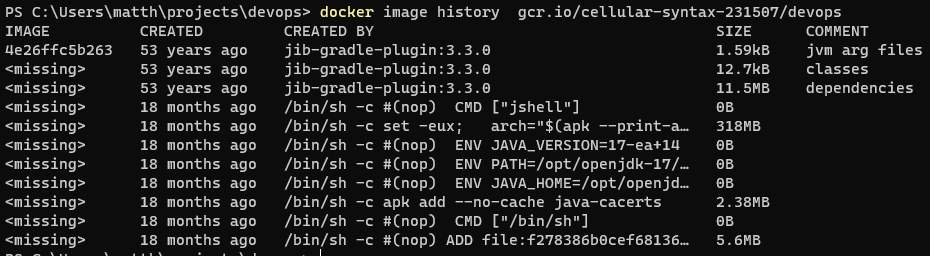

# Aufgabe 4: Arbeiten mit Docker
Im Rahmen der Aufgabe 4 soll ein Docker-Image der Applikation erstellt und auf dem Registry der Google Cloud Platform (GCP) bereitgestellt werden. Anschliessend soll das Docker-Image mittels `docker scan` auf Sicherheitslücken untersucht werden. Zudem werden weitere Experimente und Analysen betreffend Containerisierung durchgeführt und dokumentiert werden. Gewisse Teile dieser Aufgabe wurden bereits in den vorherigen Aufgaben durchgeführt und werden hier nur kurz erwähnt.

## Docker-Image
Wie bereits in Aufgabe 2 beschrieben, wurde das Docker Image der Applikation mittels Google Jib erstellt. Jib erstellt ein Docker Image ohne ein Dockerfile. Dazu muss Gradle mit dem Plugin `com.google.cloud.tools.jib` konfiguriert werden. Das Plugin wird in der `build.gradle` Datei unter `plugins` eingebunden. Anschliessend wird das Plugin konfiguriert. Dazu wird in der `build.gradle` Datei unter `jib` die Konfiguration definiert. In der Konfiguration wird das Docker Image mit dem Namen `devops` erstellt und auf die Registry der GCP hochgeladen. Die Konfiguration sieht wie folgt aus:
```groovy
jib {
    from {
        image = 'openjdk:17-alpine'
    }
    to { image = 'gcr.io/cellular-syntax-231507/devops'
        tags = [version, 'latest']
        credHelper = 'gcloud'

    }
    container {
        mainClass = 'app.App'
        ports = ['7000']
    }

}
```
Betrachtet man das generierte Image mittels `docker image history` werden die folgenden Informationen zu den einzelnen Layers angezeigt:



Es fällt auf, dass die `CREATED` Angaben für die ersten 3 Layer alle auf `53 years ago` lauten (Unix Epoch 0). Grund dafür ist die Build Strategie von Jib, mit welcher versucht wird bei unveränderten Layers den Layer-Hash zwischen den Builds exakt zu erhalten (vgl. [Jib FAQ](https://github.com/GoogleContainerTools/jib/blob/master/docs/faq.md#why-is-my-image-created-48-years-ago). In den ersten drei Layers werden laut `COMMENT` die Java JVM Argumente, die Class Filers der kompilierten Applikation und die Library Dependencies (wie in Gradle definiert) kopiert. 

### Dockerfile
Auf Grund der Aufgabenstellung wird hier jedoch nochmals ein simples Dockerfile für die Applikation erstellt. Das Dockerfile ist im Repository der Applikation unter `Dockerfile` zu finden und enthält folgenden Inhalt:
```dockerfile
FROM openjdk:17-alpine
COPY target/*.jar /app.jar
EXPOSE 7000
ENTRYPOINT ["java", "-jar", "/app.jar"]
```
Das Dockerfile ist sehr einfach gehalten und basiert auf dem offiziellen Docker Image von OpenJDK basierend auf dem schlanken Linux Alpine. Das Docker Image wird mittels `docker build .` gebaut und kann anschliessend mittels `docker run` ausgeführt werden. In der zweiten Zeile wird das erstellte JAR File in das Docker Image kopiert und als `app.jar` benannt (die App muss zuvor gebuilded worden sein). In der dritten Zeile wird der Port 7000 gegen aussen freigegeben. In der letzten Zeile wird der Entrypoint, welcher beim Starten des Containers aufgerufen wird, definiert. Damit wird das JAR File beim Starten ausgeführt.

## Docker-Image auf GCP bereitstellen
Diese Aufgabe wurde bereits in Aufgabe 2 durchgeführt. Das Docker Image wird direkt in der Jenkins Pipeline unter der Stage `create docker image and push to registry` erstellt und auf dem Registry der GCP bereitgestellt. Alternativ kann ein Docker Image mittels des Befehls `docker push gcr.io/cellular-syntax-231507/devops` auf die GCP Registry hochgeladen werden. Voraussetzung ist dazu, dass man sich mit dem Befehl `gcloud auth login` zuvor angemeldet hat. Das in der Arbeit erstellte Image kann mittels `docker pull gcr.io/cellular-syntax-231507/devops` von der Registry heruntergeladen werden.

## Analyse des Docker-Images
Um das Docker-Image auf Sicherheitslücken zu untersuchen, wird `docker scan` verwendet. Für eine detaillierte Ausgabe der Analyse wird `snyk-cli` verwendet. Dieses wird auf dem Host mittels `npm install -g snyk` installiert. Danch wird mittels `snyk auth` der Account bei Snyk authentifiziert. Anschliessend muss ein Auth Token in snyl generiert werden. Nun kann `docker scan` mittels `docker scan --login --token <token>` bei snyk authentifiziert werden. Das Docker Image kann nun mittels `docker scan --json gcr.io/cellular-syntax-231507/devops > <json-file>` analysiert und unter `<json-file>` gespeichert werden. Im Repository ist die Datei unter `docker_scan_results.json` zu finden.

## Ausblick
Würde die Applikation nun noch um eine Datenbank erweitert, liesse sich diese ebenfalls in einem Docker Container betreiben. Bei der Datenbank müssten die gespeicherten Daten natürlich persistiert werden, was mit einem Docker Volume realisiert werden kann. Die Datenbank könnte dann z. Bsp. mittels `docker run -v <volume-name>:/var/lib/postgresql/data` gestartet werden. Die Applikation könnte dann mittels `docker run --link <db-container-name>:db` mit der Datenbank verknüpft werden. Die Verknüpfung wird mittels `--link` realisiert. Die Applikation kann dann mittels Domainname `db` auf die Datenbank zugreifen. 

#### Docker Compose
Alternativ können die Container via Docker Compose in einem Docker Network verknüpft werden. Dazu müsste eine `docker-compose.yml` Datei erstellt werden, welche die Container und die Verknüpfungen definiert. Eine mögliche `docker-compose.yml` Datei könnte wie folgt aussehen:
```yaml
version: '3'
services:
  devops-webapp:
    image: gcr.io/cellular-syntax-231507/devops
    ports:
      - 80:7000
    networks:
      - devops-network
  database:
    image: postgres:15.1
    environment:
      - POSTGRES_USER=<user>
      - POSTGRES_PASSWORD=<password>
    networks:
      - devops-network
networks:
  devops-network:
    driver: bridge
```
Mittels `docker-compose up` können die Container gestartet werden. Die Applikation ist dann unter `localhost` erreichbar.

### Kubernetes Deployment
Weiter könnte die Applikation mittels Kubernetes betrieben werden. Dazu wird eine Deployment Definition benötigt, dies ist eine YAML Datei, in welcher festgelegt wird, wie die Webapp bereitgestellt werden soll. Sie muss Informationen über den Container, die Anzahl der Pods, die Art der Bereitstellung (z. Bsp. Rolling Update) und die Art der Verknüpfung mit anderen Services (wie z. Bsp. der Datenbank) enthalten. Eine mögliche Deployment Definition könnte wie folgt aussehen (App inkl. DB):
```yaml
apiVersion: apps/v1
kind: Deployment
metadata:
  name: devops-webapp
  labels:
    app: devops-webapp
spec:
  replicas: 1
  selector:
    matchLabels:
      app: devops-webapp
  template:
    metadata:
      labels:
        app: devops-webapp
    spec:
      containers:
      - name: devops-webapp
        image: gcr.io/cellular-syntax-231507/devops
        ports:
        - containerPort: 7000
      - name: devops-database
        image: postgres
        env:
        - name: POSTGRES_USER
          value: <user>
        - name: POSTGRES_PASSWORD
          value: <password>
```
Diese Definition würde ein Deployment mit dem Namen `devops-webapp` erstellen, welches aus dem in dieser Arbeit erstellten Container (`gcr.io/cellular-syntax-231507/devops`) und einer standard Postgres Datenbank (unter dem Namen `devops-database`) besteht. Der Container der App wäre dann über Port `7000` erreichbar. Beide Container würden im selben Pod (einer Einheit von Containern und Volumes in Kubernetes) ausgeführt und es würde nur ein Replikat des Pods erstellt (`replicas: 1`). Benutzernamen und Passwort für die Datenbank müssten über Umgebungsvariablen definiert werden (Beispielsweise über Kubernetes Secret). Die Definition könnte dann mittels `kubectl apply -f <deployment-definition>` erstellt werden. 

#### Kubernetes Service
Um die Applikation von aussen erreichbar zu machen, muss ein Service erstellt werden. Dieser definiert, wie die Applikation von aussen erreichbar ist. Dies kann z. Bsp. über einen Load Balancer sein, welcher die Anfragen auf die Pods verteilt. Eine mögliche Service Definition könnte wie folgt aussehen:
```yaml
apiVersion: v1
kind: Service
metadata:
  name: devops-webapp
spec:
  type: LoadBalancer
  ports:
  - port: 80
    targetPort: 7000
  selector:
    app: devops-webapp
```
Diese Definition würde einen Service mit dem Namen `devops-webapp` erstellen, welcher über Port `80` erreichbar ist. Die Anfragen würden an den Container der App weitergeleitet, welcher über Port `7000` erreichbar ist. 

#### Kubernetes Ingress
Um die Applikation über eine Domain erreichbar zu machen, muss ein Ingress erstellt werden. Dieser definiert, wie die Anfragen auf die Pods verteilt werden. Eine mögliche Ingress Definition könnte wie folgt aussehen:
```yaml
apiVersion: networking.k8s.io/v1beta1
kind: Ingress
metadata:
  name: devops-webapp
spec:
    rules:
    - host: devops.ffhs.ch
        http:
        paths:
        - path: /
            backend:
            serviceName: devops-webapp
            servicePort: 80
```
Diese Definition würde einen Ingress mit dem Namen `devops-webapp` erstellen, welcher die Anfragen an den Service `devops-webapp` weiterleitet. Die Anfragen würden an den Container der App weitergeleitet, welcher über Port `7000` erreichbar ist.
