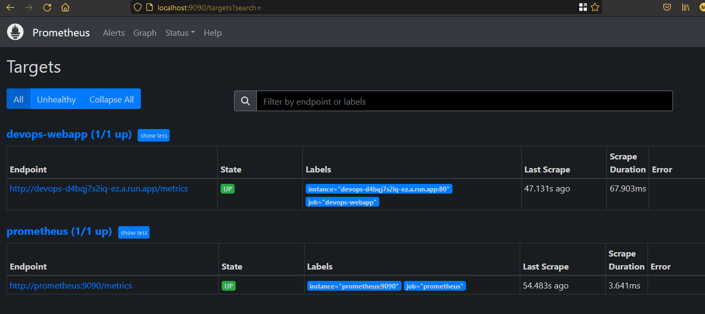
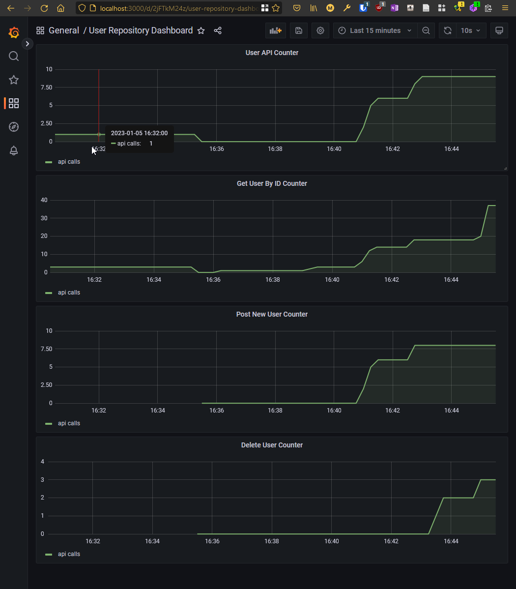

# Aufgabe 5: Arbeiten mit Prometheus und Grafana
In der finalen Aufgabe der Semesterarbeit soll ein Montioring mit Prometheus und Grafana aufgesetzt werden. Die Applikation soll dabei mit Metriken versehen werden. Die Metriken sollen in Grafana visualisiert werden. 

## Prometheus
Zunächst wird Prometheus als Docker Container aufgesetzt. Dazu wird das für Jenkins und Sonarqube verwendete Docker Compose File verwendet. Die Konfiguration von Prometheus wird in der Datei `prometheus.yml` vorgenommen. Die Konfiguration ist dabei sehr einfach. Es wird lediglich der Pfad zu den Metriken angegeben. Die Metriken werden von der Applikation selbst bereitgestellt. Im `docker-compose.yml` File wird zugleich auch Grafana als Docker Container aufgesetzt. Die Datei sieht wie folgt aus:
    
```yaml
version: "3.8"
services:
  jenkins:
      image: jenkins/jenkins:lts
      container_name: jenkins
      user: root
      ports:
          - "8080:8080"
          - "50000:50000"
      volumes:
          - ./jenkins-data:/var/jenkins_home
          - //var/run/docker.sock://var/run/docker.sock
      restart: always
      networks:
          - jenkins

  sonarqube:
      image: sonarqube:latest
      container_name: sonarqube
      ports:
          - "9000:9000"
          - "9092:9092"
      volumes:
          - ./sonarqube-data:/opt/sonarqube/data
          - ./sonarqube-extensions:/opt/sonarqube/extensions
          - ./sonarqube-logs:/opt/sonarqube/logs
          - ./sonarqube-temp:/opt/sonarqube/temp
      restart: always
      networks:
          - jenkins
  
  prometheus:
      image: prom/prometheus
      container_name: prometheus
      ports:
          - "9090:9090"
      volumes:
          - ./prometheus.yml:/etc/prometheus/prometheus.yml
      restart: always
      networks:
          - jenkins
  grafana:
      image: grafana/grafana
      container_name: grafana
      ports:
          - "3000:3000"
      volumes:
          - ./grafana-data:/var/lib/grafana
      restart: always
      networks:
          - jenkins

networks:
    jenkins:
        driver: bridge
```
Die Datei `prometheus.yml` wurde wie folgt konfiguriert:
```yaml
global:
  scrape_interval: 15s
  scrape_timeout: 10s
  evaluation_interval: 15s
scrape_configs:
- job_name: prometheus
  scrape_interval: 15s
  scrape_timeout: 10s
  static_configs:
  - targets: ['prometheus:9090']

- job_name: devops-webapp
  metrics_path: '/metrics'
  scrape_interval: 5s
  static_configs:
  - targets: ['devops-d4bqj7s2iq-ez.a.run.app']
```
Dabei wird die auf Google Cloud Run deployte App `devops-d4bqj7s2iq-ez.a.run.app` als Target angegeben. Die Metriken werden durch die App unter dem Pfad `/metrics` bereitgestellt.

## Einbinden der Metriken in die App
Zum Einbinden der Prometheus Metriken wird die Dependency `io.micrometer:micrometer-registry-prometheus:latest.release` in der Datei `build.gradle` hinzugefügt. In der Datei `App.java` werden als Metriken 4 Counter definiert:
```java
PrometheusMeterRegistry prometheusRegistry = new PrometheusMeterRegistry(PrometheusConfig.DEFAULT);
        io.micrometer.core.instrument.Counter userApiCounter = 
            prometheusRegistry.counter("user_api_counter");
        io.micrometer.core.instrument.Counter getUserByIDCounter = 
            prometheusRegistry.counter("get_user_by_id_counter");
        io.micrometer.core.instrument.Counter postNewUserCounter = 
            prometheusRegistry.counter("post_new_user_counter");
        io.micrometer.core.instrument.Counter deleteUserCounter = 
            prometheusRegistry.counter("delete_user_counter");
```
Dazu werden in den bestehenden Enpunkten die Counter inkrementiert. Hier am Beispiel des Endpunktes `getUserByID`:
```java
app.get("api/users/{id}", ctx -> {
            var id = Integer.valueOf(ctx.pathParam("id"));
            var user = users.findById(id);
            if (user.isEmpty()) {
                ctx.status(404);
            } else {
                getUserByIDCounter.increment();
                ctx.json(user.get());
            }
        });
```
### Auswahl der Metriken
Da die App nicht besonders viele Enpunkte bereitstellt und auch die Funktionalität nicht sehr umfangreich ist, können nicht allzuviele sinnvolle Counter erstellt werden. Es wird überwacht wie viele Zufgriffe die `GET` und `POST` Endpunkte haben und wie viele Nutzer gelöscht werden. Diese Metriken sind für die Überwachung der App sinnvoll, da sie einen Einblick in die Funktionalität der App geben. Alternativ liessen sich auch Metriken über die Laufzeit der App erstellen. Da die App auf Google Cloud Run läuft, wird die Laufzeit bereits duruch Google Cloud Run überwacht.

### Bereitstellen der Metriken
Damit die Metriken auch bereitgestellt werden, muss in der Datei `App.java` noch ein entsprechender Endpunkt definiert werden:
```java
// add prometheus metrics endpoint
        app.get("/metrics", ctx -> {

            ctx.result(prometheusRegistry.scrape());
        });
```
Nun wird getestet, ob die Metriken von Prometheus abgerufen werden können. Dazu wird in Prometheus unter `Status` -> `Targets` der Status der Targets überprüft. Der folgende Screenshot zeigt den Status `UP` für das Target `devops-d4bqj7s2iq-ez.a.run.app`:



Das zweite Target zeigt den durch Prometheus selbst bereitgestellten Endpunkit an, welcher dann durch Grafana abgerufen wird.

## Grafana
Zunächst wird über `Configuration > Data Sources` eine neue Datenquelle hinzugefügt. Als Typ wird `Prometheus` ausgewählt und als URL `http://prometheus:9090` angegeben. Als Name wird `Prometheus` gewählt. Nun wird über `Save & test` die Datenquelle hinzugefügt. Nun kann über `Create > Dashboard` ein neues Dashboard erstellt werden. Hier wird für jede Metrik ein Graph erstellt. Der folgenden Screenshot zeigt die erstellten Graphen:



# Abschliessende Gedanken zur Semesterarbeit
Die Semesterarbeit war eine sehr interessante Aufgabe, bei welcher ich viel neues - insbesondere die unterschiedlichen Tools - kennengelernt habe. Mein Ansatz, eine möglichst vom Hostsystem unabhängige Vorgehensweise zu verwenden (jedes verwendete Tool inkl. Jenkins in einem Container), hat mir allerdings an vielen Stellen zusätzliche Arbeit beschert. Zudem habe ich leider erst gegen Ende der Arbeit das Konzept von `Jenkins Configuration as Code` (vgl. [https://www.jenkins.io/doc/book/managing/casc/](https://www.jenkins.io/doc/book/managing/casc/)) kennengelernt, was mir besser geholfen hätte die Konfigurationen wirklich reproduzierbar zu machen. Jekins ist zwar ein sehr mächtiges Werkzeug, aber die Konfiguration über GUI wird bei komplexeren Aufgaben relativ schnell unübersichtlich. So kann Jenkins zwar einfach in einem Container gestartet werden, muss aber für jeden Schritt wieder manuell angepasst werden, was dann nicht mehr wirklich einfach reproduzierbar ist. So gesehen gefällt mir der Ansatz von GitLab etwas besser, da dort sämtliche Konfigurationen für die Pipelines rein deklarativ über die Datei `.gitlab-ci.yml`erfolgen, hat man diese Datei erst einmal erstellt, kann die Pipeline (natürlich auch hier unter gewissen Voraussetzungen, Stichwort Executor) auf jedem Runner laufen. Dass 